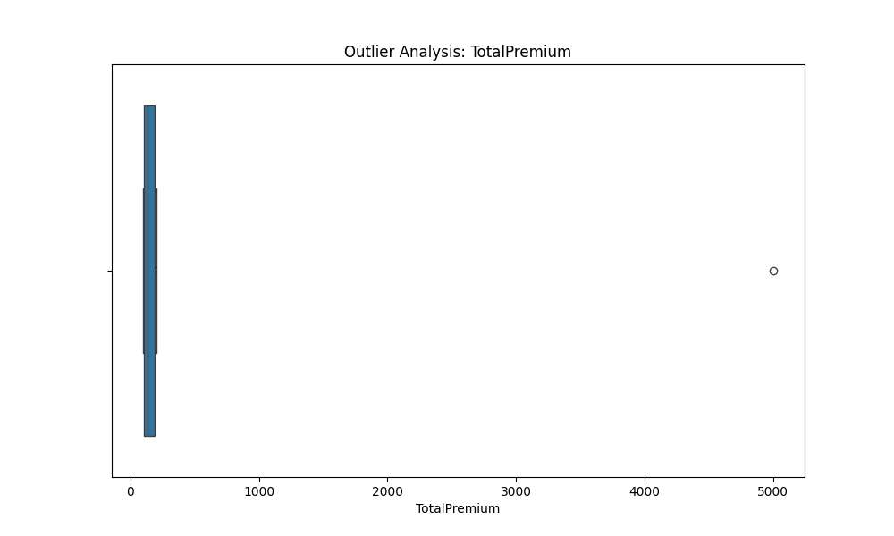
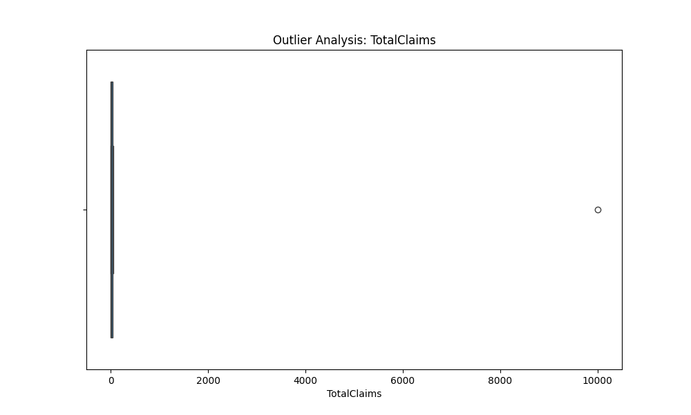

# 🛡️ AlphaCare Insurance Solutions: Risk Analytics

**Repository:** `alphacare-insurance-analytics`
**Status:** Task 1 & 2 Complete (EDA & DVC Setup)

## 📌 Project Objective
To analyze historical insurance claim data to optimize marketing strategies and identify "low-risk" targets for premium reduction.

## ⚙️ Engineering & Architecture
*   **Modular Code:** Object-oriented Python design (`src/loader.py`, `src/eda.py`).
*   **Data Version Control:** Raw data is tracked via DVC (`.dvc`), ensuring auditability without bloating the git repo.
*   **CI/CD:** GitHub Actions workflow configured for automated testing.

## 📊 Key Insights (EDA)
*   **Data Structure:** Pipe-separated (`|`) format containing Policy, Client, and Vehicle features.
*   **Financials:** Highly skewed distribution in `TotalClaims`, indicating rare but high-value loss events.
*   **Geography:** Detailed analysis of Claims distribution across Provinces (see visual outputs).

## 🚀 Usage
1.  `pip install -r requirements.txt` (Create this file if needed)
2.  `dvc pull` (Retrieves the data)
3.  `python run_pipeline.py`
## 🚀 How to Run the Project

1. **Clone the repository:**
   ```bash
   git clone https://github.com/Maireg789/alphacare-insurance-analytics.git
   cd alphacare-insurance-analytics
   ## 📊 Analysis Results
Per the feedback, outlier analysis has been performed.

### Outlier Detection (Box Plots)
The following plots identify high-risk outliers in Premiums and Claims:




> **To reproduce these figures:**  
> Run the visualization script:
> ```bash
> python src/generate_plots.py
> ```